# Rock Gods Quiz - Javascript Project: Milestone 2

Rock Gods Quiz is an interactive quiz where users answer 10 rock music based questions and are given a score out of 10. 20 questions have been created so the questions are varied for the user and not the same each time they take the quiz. The purpose of this dynamic website is for users to be able to play a quiz with questions based on rock music and musicians to test their knowledge.

## Live project

View the live project [here](https://toddnedwards.github.io/rock-gods-quiz/)

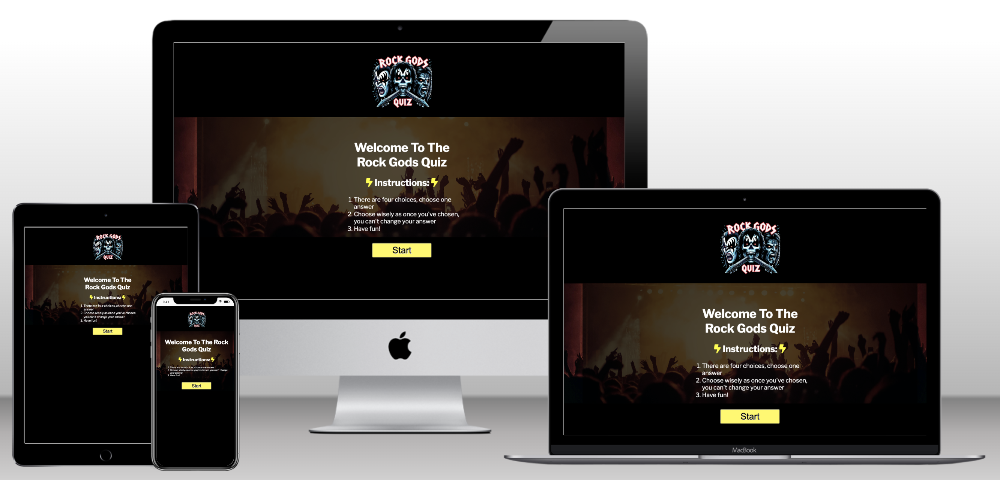

# User Experience (UX)

## User stories

### As a first time user

- I want to visit the website with a clear indication through images and text what the quiz is about.
- I want to be able to start the game easily with clearly layed out instructions and an obvious button to press to start.
- I want to see what the correct answer was once I have chosen my answer.
- I want to see my score displayed at the end.
- I want to know which question I am on as I progress through the quiz.
- I want to learn through taking the quiz and be angaged with the websites questions and design.
- I want the layout to be clear and be viewable across different devices.

### As a returning user

- I want to see a variety of questions so I'm not answering the same questions again.
- I want to be able to play more than once and see an option to do so easily.

## Structure

---

The website starts with an instructions page which lays out the rules for the user and a start button. Once pressed, the start button will begin the quiz which will take the user through an array of 10 questions. Upon completion of answering the 10 questions, the user will be shown the results page giving them their score and a button that allows the user to restart the quiz. The logo on the top center of the website also takes the user back to the instructions and start button when clicked.

## Start Page

The start page shows the logo at the top of the page, followed by instructions for the user on how to play the game, followed by a start game button.

### User Goal

- To understand the layout of the website.
- To understand from the instructions how to play the game
- To be directed through clearly labelled buttons through the game
- To want to play the game again

### Website Goal

- To create a simple and clear understanding of how to play the game
- To make an enjoying and enticing game for the user to want to play
- To clearly show details on how to play the game

## Quiz Page

---

The quiz page has the logo at the top of the page, followed by a numbered question and 4 answer options. The button options will be buttons giving the user the option to click their answer. Once clicked, a "next" button will appear to allow the user to move the next question. Once all 10 questions have been answered, the user will be presented with a different button to view their results.

### User Goal

- To be able to read the questions clearly and precisely
- To see the questions are numbered to know which question out of 10 they are on
- To be able to read the answer options clearly and precisely
- To be able to click on their answer
- To see if their answer was correct or not once chosen
- To be given the option to go to the next question once they've answered the current question
- To be able to see their results once all 10 questions have been answered

### Website Goal

- To make all writing clear and visible for the user
- To make all answer options clickable so the user can choose their answer
- To show the user a variety of questions so the same questions aren't being repeated for them
- To allow the user to see the "next" and "see results" buttons when they've either chosen their answer or completed the quiz

## Results Page

---

The results page displays the logo at the top of the page, followed by a text box congratulating the user on their score, and showing the user what their score was. Different results brackets are given different text to reflect how well the user did. Eg. Scoring between 6 and 8 out of 10 displays "You know your rock!"

### User Goal

- To be able to see what they scored clearly and visibly
- To be shown a message that reflects how well they did as feedback
-

### Website Goal

- To make all writing clear and visible for the user
- To make all answer options clickable so the user can choose their answer
- To show the user a variety of questions so the same questions aren't being repeated for them
- To allow the user to see the "next" and "see results" buttons when they've either chosen their answer or completed the quiz

## Wireframes

---

### Start Page

[Desktop View](assets/images/readme/wireframes/start-page-full-screen.png) |
[Ipad/ Tablet View](assets/images/readme//wireframes/start-page-tablet.png) |
[Smartphone View](assets/images/readme//wireframes/start-page-smartphone.png)

### Questions Page

[Desktop View](assets/images/readme/wireframes/quiz-page-full-screen.png) |
[Ipad/ Tablet View](assets/images/readme//wireframes/questions-page-tablet.png) |
[Smartphone View](assets/images/readme//wireframes/questions-page-smartphone.png)

### Results Page

[Desktop View](assets/images/readme/wireframes/results-page-full-screen.png) |
[Ipad/ Tablet View](assets/images/readme//wireframes/results-page-tablet.png) |
[Smartphone View](assets/images/readme//wireframes/results-page-smartphone.png)

---

## Design

The design was based on colours usually associated with rock and metal music, using black as the main colour, and yellow to be similar to lightning which is always used in rock imagery, and to also match the lightning bolt icons each side of the instructions title.

### Colour Scheme

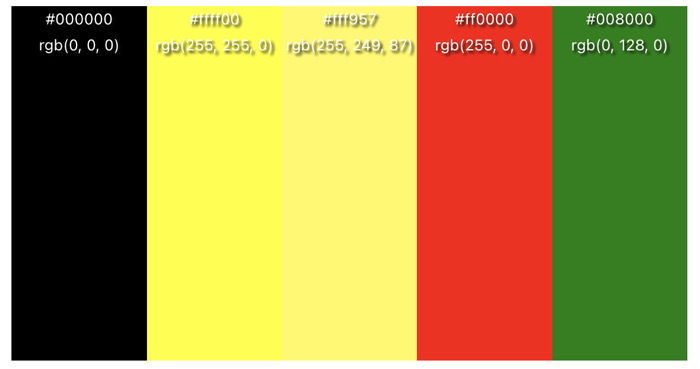

The colours shown are black for background, yellow for instructions and, a lighter yellow for the answer option buttons, and a green and red for correct and incorrect answers to be shown to the user for confirmation. The website also uses white text (#ffffff) for text to contrast well against the black (#000000) background for reader useability.

The colour palette was created at: [www.color-hex.com](https://www.color-hex.com).

### Typography

For fonts, I looked through text that would be bold and clear for the user. There we're some rock themed texts which didn't work for the design and decided to go with a simpler font for the users visibility.

I used google fonts API to incorporate the desired font. The font I used was Libre Franklin which is viewable below:

[Libre Franklin](https://fonts.google.com/specimen/Libre+Franklin?query=libre+franklin)

I used this with a backup of sans-serif incase of any loading issues for the user.

### Images

The Rock Gods Quiz logo was created by Bing Create AI by myself: [Click here to view bing create](https://www.bing.com/images/create?toWww=1&redig=BD16EF32B63245C0AFAF1F67B5192595).
The background audience image was sourced from: [www.pexels.com/photo/people-at-concert-1105666](https://www.pexels.com/photo/people-at-concert-1105666/).

### Accessibility

- Title is added to the logo at the top of the screen to provide the text description "Go To Home Page (Start Quiz Again)" when clicked.
- Alt labels been provided to the logo to provide information for screen readers.
- Ticks and crosses have been added once an answer has been chosen to provide further confirmation to colour blind users if their ansswer was correct or not.
- Bold white text chosen against a contrasting black background to provide clear visibility for the user.

### Visual Effects

#### Hover on buttons

To make it clearer for the user on answer options, whilst hovering over the buttons, they change to a lighter saturation of the original colour and become wider giving a clearer confirmation of which button they are hovering over. This also makes it more engaging and more visual for the user.

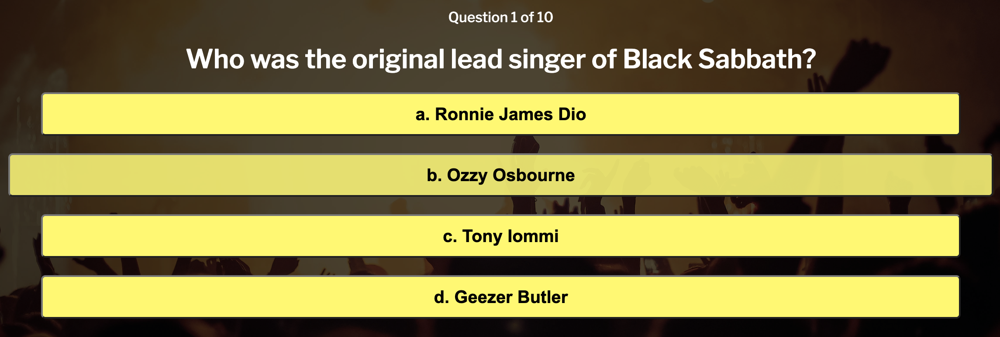

#### Buttons

- All answer option buttons once pressed will either turn green or red to show if the answer was correct or incorrect. This makes it more visually entertaining for the user as well as providing further clarification on if their answer was correct or not.

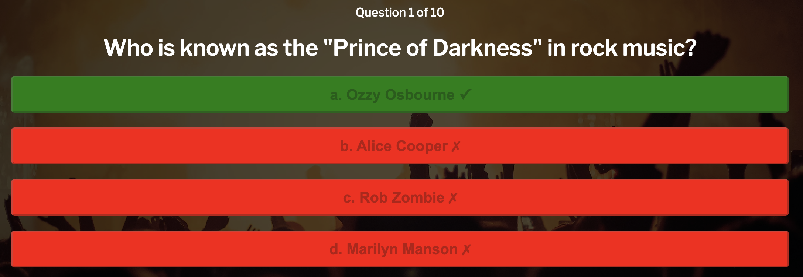

- The start and see results buttons have a transition of 0.3s to make them more visually engaging and again to give a clear indication to the user they are hovering over the button.

---

# Features

---

## Existing Features

- **Logo (Home Page)**

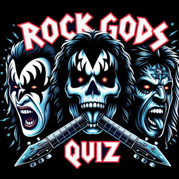
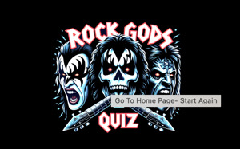

The logo is present on all pages of the website and acts as a hyperlink to go back to the start of the quiz and back to the first home page. When hovered over it also provides an alt text to help users see its purpose rather than just assuming that it is clickable.

- **Start Page/ Instructions**
  The start page is the first page to appear for the user. It includes a background image of an audience which appears constantly across all 3 pages. It shows 3 instruction bullet points followed by a start button. The start button on hover expands to make it more obvious to the user that it is interactive and also makes the page more engaging for the user.

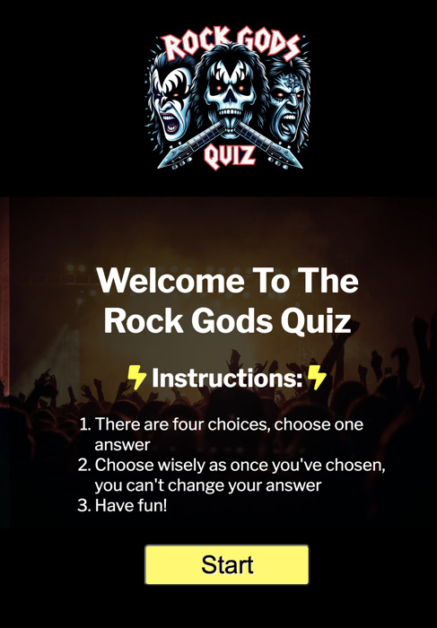

- **Questions/ Quiz Area**

This section includes 10 questions for the user to go through. It is supplied with a question which is numbered so the user knows how far through the quiz they are and how many questions they have left. There are 4 answer options buttons. When they are hovered over, they expand in size using a transition of 0.3 seconds. When hovered over, they also change to a darker saturation of yellow to make it more obvious to the user which one they are hovering over.

Once the user has chosen their answer, the answer options will become disabled, stopping the user from choosing a different answer or continuing to press a button to make the score go artificially higher. The buttons will red if they are incorrect and the correct button will turn green. The incorrect options will also show an 'x' symbol next the answer option to visually show they are incorrect for colour blind users. The correct option also shows a '✓' symbol to show the answer is correct for colour blind users who can't see the colour change of green and red.

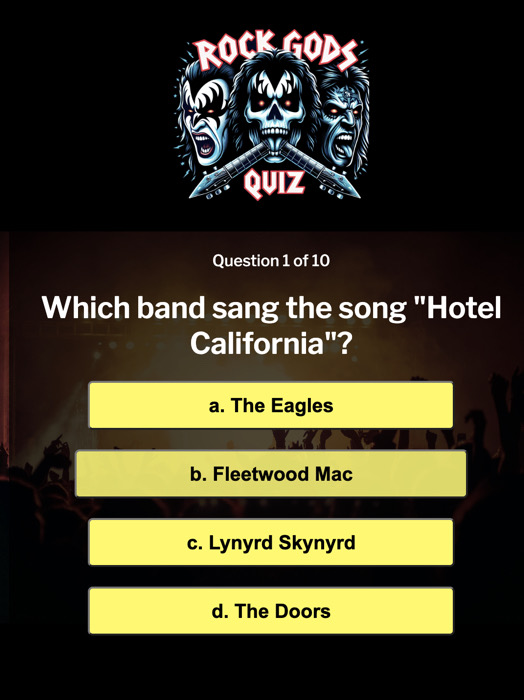

- **Results Page**

On the results page the user is told "congratulations" and is shown their score out of 10. Depending on their score, they will be shown a different phrase that corresponds with their score as shown below:

- if the score is more than 8, the user is shown "You are a rock god!"
- if the score is more than 6 but less than 8, the user is shown "You know your rock!"
- if the score is more than 4 but less than 6, the user is shown "You're on your way to rock stardom!"
- if the score is more than 2 but less than 4, the user is shown "You've got some practicing to do!"
- if the score is more than 0 but less than 2, the user is shown "Just put the guitar down"

The results page is also presented with a button that says 'try again' which will take the user back to the questions page with the score reset. The button also expands on hover to keep the page engaging and interactive, and to also make it clear to the user that they are hovering over that button.

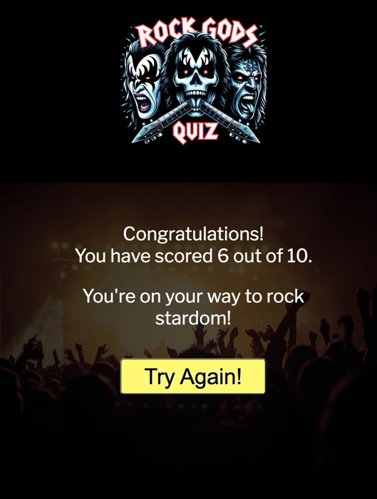

## Feature Considerations

### Sound

I would like to add sound to the project as a touch to stay with the theme of music overall. I decided not to include it as it caused complications and needed to create other elements to give the user control of if the music was muted etc. I would also consider having one long piece of music that would be on loop, and would change when the user pressed a button, such as a guitar riff when the start button is played, and maybe a crowd cheer when the user chooses a correct answer and an audience booing when they choose a wrong answer.

---

# Technologies

- Languages: HTML, CSS, JavaScript
- Git - For version control.
- [GitHub](https://GitHub.com/) - To save and store the files as repositories for the website.
- [Codeanywhere](https://app.codeanywhere.com/) - IDE to develop the website
- [Visual Code Studios](https://code.visualstudio.com/) - IDE I initially used to develop the website whilst having no internet access
- [Color Converter](https://htmlcolors.com/color-converter) - To convert hex colours into HSLA format to use saturation on buttons.
- [Bing's Create AI image generator](https://www.bing.com/images/create?toWww=1&redig=BD16EF32B63245C0AFAF1F67B5192595) - To create the logo.
- [Google Fonts](https://fonts.google.com/) - To import fonts that we're used on the website
- [Google Chrome Dev Tools](https://developers.google.com/web/tools/chrome-devtools)- To troubleshoot css flaws and try different design options, debugging with console, checking responsiveness and checking overall web experience with lighthouse.
- [Favicon.cc](https://www.favicon.cc/) - Used to create the website favicon.
- Google Chrome's [Lighthouse](https://developers.google.com/web/tools/lighthouse) - To see websites accessibility and performance.
- [W3C HTML Markup Validator](https://validator.w3.org/) to validate HTML code.
- [W3C Jigsaw CSS Validator](https://jigsaw.w3.org/css-validator/) to validate CSS code.
- Code Institute's Gitpod Template to generate the workspace for the project.

---

# Testing

Testing has been carried out since the start of the build, using google chrome's dev tools and codeanywhere to highlight faults in coding. A logical plan was written out beforehand of the project so I knew how I would then structure it. The logical plan is included in my user stories below. I also tested the site on different browsers including firefox and safari as well as testing on an ipad and samsung galaxy s21.

# User Stories

| Expectations                                             | realisations                                                                                                                                                                                                                              |
| -------------------------------------------------------- | ----------------------------------------------------------------------------------------------------------------------------------------------------------------------------------------------------------------------------------------- |
| Understand the purpose of the website and how to use it. | The first page shows the logo which gives an image of what the subject is (rock music), it gives instructions to what the game is and what the rules are.                                                                                 |
| To be able to play the game easily                       | The question and question number is clearly started on the page. The user is given 4 possible answers and is prompted by the hover class to choose an answer.                                                                             |
| To know what the correct answer to the game is.          | After the answer is selected, the correct answer button will turn green and the incorrect answers will turn red. A corresponding tick or cross will also appear to give clearer indication to if the answer is correct or not.            |
| To know my score.                                        | The user is given their score once they finish all 10 questions and is prompted to go to the results page. The results page then tells the user what their score was out of 10.                                                           |
| To be able to navigate easily.                           | When the user clicks the logo displayed on each page, it returns them to the instructions page. Alt text on the logo also makes this clearer. On the results page, a try again button is shown to give the user the option to play again. |
| I want to play again once i've completed the game        | On the results page, the user is presented with another button titled 'try again' to restart the quiz and reset the score.                                                                                                                |
| I want to see the information clearly                    | Alt text has been supplied for the logo, I have used dark colours with white text for the main parts, apart from black text on the answer options for better contrast so the user can see them clearly.                                   |

# Solved issues

The following issues arose and were solved through testing, W3 Schools resources, and peer advice.

- The background image source path wasn't working - Steve Whitehouse_bc in the slack community helped me change the path to ../ instead starting with a / for github formatting.
- For using title to show purpose of the logo for the user to show them it will take them back the start of the website and restart the quiz: https://www.w3schools.com/tags/tag_title.asp
- I had a spelling error in one of the functions i was calling in startQuiz(), I resolved this by running console in google chrome and it pointing out to me which function was not specified. This helped me find the mispelling and change it.
- I couldn't work out how to disable a button in javascript. I used this advice from W3 schools: https://www.w3schools.com/jsref/prop_pushbutton_disabled.asp
- Initial testing on lighthouse raised that images were slowing down performance - images cropped and resized to fit space. Images converted to webp.

## Automated Testing

### [W3 Markup Validation](https://validator.w3.org/) - HTML Validation

All pages were run through HTML Validator. No errors were detected.

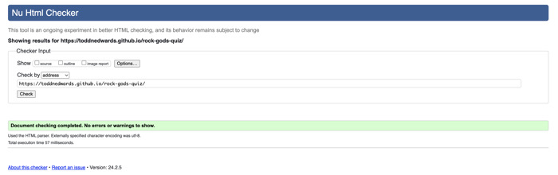

### [W3 Jigsaw](https://jigsaw.w3.org/css-validator/) - CSS Validation

CSS Stylesheet was run through CSS Validator. No errors were detected.

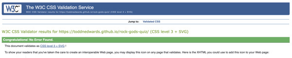

### [Google Lighthouse](https://developers.google.com/web/tools/lighthouse)**

Google lighthouse gave original a performance of 91 in desktop view. I improved this by changing the size of the logo image down to 300x300 pixels.
In SEO it also suggested adding a meta description which I added, using the souce information from: https://www.w3schools.com/tags/tag_meta.asp.

It also suggested I downsize the audience background image, which I downsized to 1200 × 800 pixels. This was to keep the proportion of the image, and using the resource of what size to use from [google search](https://www.google.com/search?q=what+pixel+size+for+background+image&sca_esv=ce89b3ae00b5c8b0&rlz=1C5CHFA_enGB1022GB1024&sxsrf=ACQVn08oS4NQOjTiUjnv7Q_AbfJU3sV4HQ%3A1707307031636&ei=F3DDZe-oJqyN9u8Pqbuk6AE&oq=what+pixel+size+for+background+&gs_lp=Egxnd3Mtd2l6LXNlcnAiH3doYXQgcGl4ZWwgc2l6ZSBmb3IgYmFja2dyb3VuZCAqAggAMgUQIRigATIFECEYoAEyBRAhGKABMgUQIRifBUi5GFCvB1jHD3ABeAGQAQCYAZIBoAH8B6oBAzkuMrgBA8gBAPgBAcICChAAGEcY1gQYsAPCAgYQABgWGB7CAgsQABiABBiKBRiGA8ICBxAhGAoYoAHiAwQYACBBiAYBkAYI&sclient=gws-wiz-serp).

**Home Page**

Mobile

Desktop

# Deployment

This project was deployed to GitHub pages. The steps to deploy are as follows:

1. Log in (or sign up) to Github.
2. Find the repository for this project, rock gods quiz.
3. Click on the Settings from the Repositories sub-headings.
4. Click on the Pages link in the left hand side navigation bar.
5. In the Source heading, choose main from the drop down select branch menu. Select Root from the drop down select folder menu.
6. Click Save.
7. A message that the website is ready to be deployed will appear. Refresh the page and the link to the deployed site will be available.
8. Your live Github Pages site is now deployed at the URL shown.

The live link can be found [here](https://toddnedwards.github.io/rock-gods-quiz/).

## How to run this project Locally

- **Clone the repository**

1. Log in (or sign up) to GitHub.
2. Navigate to the GitHub Repository for this project, toddnedwards/rock-gods-quiz.
1. Click the code drop-down menu. Select whether you would like to clone with HTTPS, SSH or GitHub CLI and copy the link shown.
2. Open a terminal in the directory of your choice, type 'git clone' and paste the link from step 3.
3. A clone of the repository will now be created on your machine.

---

# Credits

## Code

- Tutorials from Code Institute's resources of javascript.
- Quiz game tutorial tips I used for setStatusClass to change colours of correct and incorrect answer's from [GreatStack](https://www.youtube.com/watch?v=PBcqGxrr9g8)
- Javascript tutorials from [freeCodeCamp.org](https://www.youtube.com/watch?v=ec8vSKJuZTk&t=788s)
- Tick and cross symbols copied and pasted from: https://www.i2symbol.com/symbols/check.
- Code stated above with hyperlinks used from [W3 Schools](https://www.w3schools.com/).

## Content

All content for this website has been written and coded by Todd Edwards

Readme.md file was created based on the structure of [Code Institute readme template](https://github.com/Code-Institute-Solutions/readme-template) and [Emily Cheatham's structure](https://github.com/emilycheatham/Project2Quiz/blob/main/README.md)

## Media

- Background image of audience was taken from [pexels](https://www.pexels.com/).
- Logo for the website was created by an AI creator from [Bing Creator](https://www.bing.com/images/create?toWww=1&redig=BD16EF32B63245C0AFAF1F67B5192595)

## Acknowledgements

I would like to thank my mentor, Martina Terlevic for their support in finalising my project. 

Thankyou to Steve Whitehouse_bc on the slack community for helping with file path for my background image created on the style sheet (style.css line 8).

Thankyou for ndsurgenor in the slack community for suggesting removing the hover effect after an answer has been chosen and to adding a visual tick and cross to make the answer clearer for colour blind users.

Thankyou for Ed Denham_alum in the slack community for reminding me to remove console.logs for providing the current score in console and also stating that the game has started (which is something I originally added to test that the function was running). He also pointed out to me that due to the answer buttons not being disabled on clicking, they could be manipulated and the score could keep increasing on answering. This prompted me to find out the button disable through the W3 schools resource and remove that option for the user.

A huge thankyou to the code institute slack community for coding problems that I had by searching for the problems I incurred.