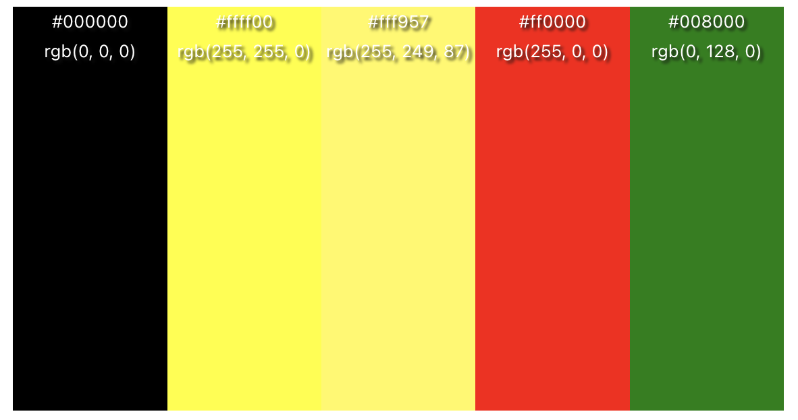

# Rock Gods Quiz - Javascript Project: Milestone 2

Rock Gods Quiz is an interactive quiz where users answer 10 rock music based questions and are given a score out of 10. 20 questions have been created so the questions are varied for the user and not the same each time they take the quiz. The purpose of this dynamic website is for users to be able to play a quiz with questions based on rock music and musicians to test their knowledge.

## Live project

View the live project [here](https://toddnedwards.github.io/rock-gods-quiz/)

# User Experience (UX)

## User stories

### As a first time user

- I want to visit the website with a clear indication through images and text what the quiz is about.
- I want to be able to start the game easily with clearly layed out instructions and an obvious button to press to start.
- I want to see what the correct answer was once I have chosen my answer.
- I want to see my score displayed at the end.
- I want to know which question I am on as I progress through the quiz.
- I want to learn through taking the quiz and be angaged with the websites questions and design.
- I want the layout to be clear and be viewable across different devices.

### As a returning user

- I want to see a variety of questions so I'm not answering the same questions again.
- I want to be able to play more than once and see an option to do so easily.

## Structure

---

The website starts with an instructions page which lays out the rules for the user and a start button. Once pressed, the start button will begin the quiz which will take the user through an array of 10 questions. Upon completion of answering the 10 questions, the user will be shown the results page giving them their score and a button that allows the user to restart the quiz. The logo on the top center of the website also takes the user back to the instructions and start button when clicked.

## Start Page

The start page shows the logo at the top of the page, followed by instructions for the user on how to play the game, followed by a start game button.

### User Goal

- To understand the layout of the website.
- To understand from the instructions how to play the game
- To be directed through clearly labelled buttons through the game
- To want to play the game again

### Website Goal

- To create a simple and clear understanding of how to play the game
- To make an enjoying and enticing game for the user to want to play
- To clearly show details on how to play the game

## Quiz Page

---

The quiz page has the logo at the top of the page, followed by a numbered question and 4 answer options. The button options will be buttons giving the user the option to click their answer. Once clicked, a "next" button will appear to allow the user to move the next question. Once all 10 questions have been answered, the user will be presented with a different button to view their results.

### User Goal

- To be able to read the questions clearly and precisely
- To see the questions are numbered to know which question out of 10 they are on
- To be able to read the answer options clearly and precisely
- To be able to click on their answer
- To see if their answer was correct or not once chosen
- To be given the option to go to the next question once they've answered the current question
- To be able to see their results once all 10 questions have been answered

### Website Goal

- To make all writing clear and visible for the user
- To make all answer options clickable so the user can choose their answer
- To show the user a variety of questions so the same questions aren't being repeated for them
- To allow the user to see the "next" and "see results" buttons when they've either chosen their answer or completed the quiz

## Results Page

---

The results page displays the logo at the top of the page, followed by a text box congratulating the user on their score, and showing the user what their score was. Different results brackets are given different text to reflect how well the user did. Eg. Scoring between 6 and 8 out of 10 displays "You know your rock!"

### User Goal

- To be able to see what they scored clearly and visibly
- To be shown a message that reflects how well they did as feedback
-

### Website Goal

- To make all writing clear and visible for the user
- To make all answer options clickable so the user can choose their answer
- To show the user a variety of questions so the same questions aren't being repeated for them
- To allow the user to see the "next" and "see results" buttons when they've either chosen their answer or completed the quiz

## Wireframes

---

### Start Page

[Desktop View](assets/readme/wireframes/start-page-full-screen.png) |
[Ipad/ Tablet View](assets/readme//wireframes/start-page-tablet.png) |
[Smartphone View](assets/readme//wireframes/start-page-smartphone.png)

### Questions Page

[Desktop View](assets/readme/wireframes/quiz-page-full-screen.png) |
[Ipad/ Tablet View](assets/readme//wireframes/questions-page-tablet.png) |
[Smartphone View](assets/readme//wireframes/questions-page-smartphone.png)

### Results Page

[Desktop View](assets/readme/wireframes/results-page-full-screen.png) |
[Ipad/ Tablet View](assets/readme//wireframes/results-page-tablet.png) |
[Smartphone View](assets/readme//wireframes/results-page-smartphone.png)

---

## Design

The design was based on colours usually associated with rock and metal music, using black as the main colour, and yellow to be similar to lightning which is always used in rock imagery, and to also match the lightning bolt icons each side of the instructions title.

### Colour Scheme

The colours shown are black for background, yellow for instructions and, a lighter yellow for the answer option buttons, and a green and red for correct and incorrect answers to be shown to the user for confirmation. The website also uses white text (#ffffff) for text to contrast well against the black (#000000) background for reader useability.

The colour palette was created at: [www.color-hex.com](https://www.color-hex.com).

### Typography

For fonts, I looked through text that would be bold and clear for the user. There we're some rock themed texts which didn't work for the design and decided to go with a simpler font for the users visibility.

I used google fonts API to incorporate the desired font. The font I used was Libre Franklin which is viewable below:

[Libre Franklin](https://fonts.google.com/specimen/Libre+Franklin?query=libre+franklin)

I used this with a backup of sans-serif incase of any loading issues for the user.

### Images

The Rock Gods Quiz logo was created by Bing Create AI by myself: [Click here to view bing create](https://www.bing.com/images/create?toWww=1&redig=BD16EF32B63245C0AFAF1F67B5192595).
The background audience image was sourced from: [www.pexels.com/photo/people-at-concert-1105666](https://www.pexels.com/photo/people-at-concert-1105666/).

### Accessibility

- Title is added to the logo at the top of the screen to provide the text description "Go To Home Page (Start Quiz Again)" when clicked.
- Alt labels been provided to the logo to provide information for screen readers.
- Ticks and crosses have been added once an answer has been chosen to provide further confirmation to colour blind users if their ansswer was correct or not.
- Bold white text chosen against a contrasting black background to provide clear visibility for the user.

### Visual Effects

#### Hover on buttons

To make it clearer for the user on answer options, whilst hovering over the buttons, they change to a lighter saturation of the original colour and become wider giving a clearer confirmation of which button they are hovering over. This also makes it more engaging and more visual for the user.

#### Buttons

- All answer option buttons once pressed will either turn green or red to show if the answer was correct or incorrect. This makes it more visually entertaining for the user as well as providing further clarification on if their answer was correct or not.

- The start and see results buttons have a transition of 0.3s to make them more visually engaging and again to give a clear indication to the user they are hovering over the button.

---

# Features

---

## Existing Features

- **Logo (Home Page)**

The Logo, which is also a link to the home page, is present on all pages on the website. By clicking on this, the user can navigate back to the Home page at any moment of the game. This is explained in the introduction, but also when hovered over, the title appears to help the user understand that it is a link.

- **Instruction Area**
  The instructions is the first area the user see.s It draws them in the the scroll background and the Ministry of Magic logo.
  It has a text input box so the user can enter their name. This will be used later for the results.
  This instructions area makes it clear what the quiz is about. It lays out how many questions the user will recieve, how to answer the questions and make it clear that once they click they cannot change their answer. It states how to restart, but warns them that the questions may be different.
  The start button is large and central, making it clear hwo to start the quiz.

- **Question Area**

This section contains the 10 questions. At the top, it is clear what question out of 10 they are on. The question is large. 4 options are provided. The buttons are spaced far enough appart to reduce the chance of accidental clicking.
This is responsive, with the buttons turning into a 2 x 2 grid for larger devices.

- **Correct / Incorrect Answers**

When an answer has been selected, the buttons change colour to show which answer is correct and which are incorrect. The next button shows. There is no timer, as this allows the user to go onto the next question in their own time.

- **Results Page**
  This page pulls their name from the text input in the instructions, and places their name on the results page. This page tells the user what their score out of 10 was. The ministry of Magic logo is shown again to link it back to the instructions page. Based on their score, they are awarded an OWL grade:
  0 = Troll
  1-2 = Dreaful
  3-4 = Poor
  5-6 = Acceptable
  7-8 = Exceeds Expectations
  9-10 = Outstanding
  An option to restart the quiz is diplayed. There is no timer, this allows the user to start again in their own time.

## Feature Considerations

### Sound

At present no sound is used. It was considered having the theme tune as background music, but it was deemed not to add much to the experience and the image to mute the sound was out of place in the header, with the minimalistic logo.
Sounds for getting the answer correct or wrong was considered, but no relevant sound could be found.

---

# Technologies

- Languages: HTML, CSS, JavaScript
- Git - For version control.
- [GitHub](https://GitHub.com/) - To save and store the files for the website
- [Gitpod](https://gitpod.io/) - IDE to develop the website
- [Google Fonts](https://fonts.google.com/) - To import the fonts used on the wesbite
- [Google Chrome Dev Tools](https://developers.google.com/web/tools/chrome-devtools)- To troubleshoot, debugging, inspecting page's elements, testing responsiveness and solving issues with responsiveness and styling.
- [Favicon.cc](https://www.favicon.cc/) - to create the website favicon.
- Google Chrome's [Lighthouse](https://developers.google.com/web/tools/lighthouse) - to access preformance and accesibility
- Toptal [Colorfilter](https://www.toptal.com/designers/colorfilter/) - to check visuals for colour blind anomalies
- [W3C HTML Markup Validator](https://validator.w3.org/) to validate HTML code.
- [W3C Jigsaw CSS Validator](https://jigsaw.w3.org/css-validator/) to validate CSS code.
- [Markdown Tables Generator](https://www.tablesgenerator.com/) to generate tables for the readme file.
- Code Institute's Gitpod Template to generate the workspace for the project.

---

- **Club Ethos Section**

  - The club ethos section will allow the user to see the benefits of joining the Love Running meetups, as well as the benefits of running overall.
  - This user will see the value of signing up for the Love Running meetups. This should encourage the user to consider running as their form of exercise.

- **Meetup Times section**

  - This section will allow the user to see exactly when the meetups will happen, where they will be located and how long the run will be in kilometers.
  - This section will be updated as these times change to keep the user up to date.

- **The Footer**

  - The footer section includes links to the relevant social media sites for Love Running. The links will open to a new tab to allow easy navigation for the user.
  - The footer is valuable to the user as it encourages them to keep connected via social media

- **Gallery**

  - The gallery will provide the user with supporting images to see what the meet ups look like.
  - This section is valuable to the user as they will be able to easily identify the types of events the organisation puts together.

- **The Sign Up Page**

  - This page will allow the user to get signed up to Love Running to start their running journey with the community. The user will be able specify if they would like to take part in road, trail or both types of running. The user will be asked to submit their full name and email address.

For some/all of your features, you may choose to reference the specific project files that implement them.

In addition, you may also use this section to discuss plans for additional features to be implemented in the future:

### Features Left to Implement

- Another feature idea

## Testing

In this section, you need to convince the assessor that you have conducted enough testing to legitimately believe that the site works well. Essentially, in this part you will want to go over all of your project’s features and ensure that they all work as intended, with the project providing an easy and straightforward way for the users to achieve their goals.

In addition, you should mention in this section how your project looks and works on different browsers and screen sizes.

You should also mention in this section any interesting bugs or problems you discovered during your testing, even if you haven't addressed them yet.

If this section grows too long, you may want to split it off into a separate file and link to it from here.

### Validator Testing

- HTML
  - No errors were returned when passing through the official [W3C validator](https://validator.w3.org/nu/?doc=https%3A%2F%2Fcode-institute-org.github.io%2Flove-running-2.0%2Findex.html)
- CSS
  - No errors were found when passing through the official [(Jigsaw) validator](https://jigsaw.w3.org/css-validator/validator?uri=https%3A%2F%2Fvalidator.w3.org%2Fnu%2F%3Fdoc%3Dhttps%253A%252F%252Fcode-institute-org.github.io%252Flove-running-2.0%252Findex.html&profile=css3svg&usermedium=all&warning=1&vextwarning=&lang=en#css)

### Unfixed Bugs

You will need to mention unfixed bugs and why they were not fixed. This section should include shortcomings of the frameworks or technologies used. Although time can be a big variable to consider, paucity of time and difficulty understanding implementation is not a valid reason to leave bugs unfixed.

## Deployment

This section should describe the process you went through to deploy the project to a hosting platform (e.g. GitHub)

- The site was deployed to GitHub pages. The steps to deploy are as follows:
  - In the GitHub repository, navigate to the Settings tab
  - From the source section drop-down menu, select the Master Branch
  - Once the master branch has been selected, the page will be automatically refreshed with a detailed ribbon display to indicate the successful deployment.

The live link can be found here - <https://code-institute-org.github.io/love-running-2.0/index.html>

## Credits

In this section you need to reference where you got your content, media and extra help from. It is common practice to use code from other repositories and tutorials, however, it is important to be very specific about these sources to avoid plagiarism.

You can break the credits section up into Content and Media, depending on what you have included in your project.

### Content

- The text for the Home page was taken from Wikipedia Article A
- Instructions on how to implement form validation on the Sign Up page was taken from [Specific YouTube Tutorial](https://www.youtube.com/)
- The icons in the footer were taken from [Font Awesome](https://fontawesome.com/)

### Media

- The photos used on the home and sign up page are from This Open Source site
- The images used for the gallery page were taken from this other open source site

Congratulations on completing your Readme, you have made another big stride in the direction of being a developer!

## Other General Project Advice

Below you will find a couple of extra tips that may be helpful when completing your project. Remember that each of these projects will become part of your final portfolio so it’s important to allow enough time to showcase your best work!

- One of the most basic elements of keeping a healthy commit history is with the commit message. When getting started with your project, read through [this article](https://chris.beams.io/posts/git-commit/) by Chris Beams on How to Write a Git Commit Message

  - Make sure to keep the messages in the imperative mood

- When naming the files in your project directory, make sure to consider meaningful naming of files, point to specific names and sections of content.

  - For example, instead of naming an image used ‘image1.png’ consider naming it ‘landing_page_img.png’. This will ensure that there are clear file paths kept.

- Do some extra research on good and bad coding practices, there are a handful of useful articles to read, consider reviewing the following list when getting started:
  - [Writing Your Best Code](https://learn.shayhowe.com/html-css/writing-your-best-code/)
  - [HTML & CSS Coding Best Practices](https://medium.com/@inceptiondj.info/html-css-coding-best-practice-fadb9870a00f)
  - [Google HTML/CSS Style Guide](https://google.github.io/styleguide/htmlcssguide.html#General)

Getting started with your Portfolio Projects can be daunting, planning your project can make it a lot easier to tackle, take small steps to reach the final outcome and enjoy the process!

Thankyou to Steve Whitehouse_bc on the slack community for helping with file path for my background image created on the style sheet (style.css line 8).

for using title to show purpose of the logo for user to show them it will take them back the start of the website and restart the quiz:
<https://www.w3schools.com/tags/tag_title.asp>

tick and cross symbols copied and pasted from: https://www.i2symbol.com/symbols/check
